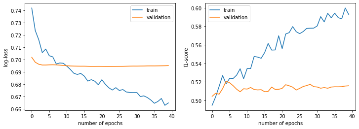

```python
import os
import time

import pandas as pd
import numpy as np
from tqdm.notebook import tqdm
import torch

from classy.preprocess.tokenize import FilterTokenize_DF
from classy.preprocess.embed import Generate_Embeddings
from datasets import load_dataset
```

Here we demonstrate the use of classy in loading a dataset, doing tokenization, generating embeddings followed by training a neural network to learn the sentiment label

## Tokenize and Generate Embeddings

### load imdb dataset


```python
df = load_dataset('imdb',split=['train','test'])

df_train = df[0].to_pandas()

df_train.head()
```

    Reusing dataset imdb (C:\Users\taraf\.cache\huggingface\datasets\imdb\plain_text\1.0.0\2fdd8b9bcadd6e7055e742a706876ba43f19faee861df134affd7a3f60fc38a1)
    


      0%|          | 0/2 [00:00<?, ?it/s]


<div>
<table border="1" class="dataframe">
  <thead>
    <tr style="text-align: right;">
      <th></th>
      <th>text</th>
      <th>label</th>
    </tr>
  </thead>
  <tbody>
    <tr>
      <th>0</th>
      <td>I rented I AM CURIOUS-YELLOW from my video sto...</td>
      <td>0</td>
    </tr>
    <tr>
      <th>1</th>
      <td>"I Am Curious: Yellow" is a risible and preten...</td>
      <td>0</td>
    </tr>
    <tr>
      <th>2</th>
      <td>If only to avoid making this type of film in t...</td>
      <td>0</td>
    </tr>
    <tr>
      <th>3</th>
      <td>This film was probably inspired by Godard's Ma...</td>
      <td>0</td>
    </tr>
    <tr>
      <th>4</th>
      <td>Oh, brother...after hearing about this ridicul...</td>
      <td>0</td>
    </tr>
  </tbody>
</table>
</div>


### tokenize the dataset using treebank or spacy based tokenization 


```python
df_train = FilterTokenize_DF(df_train, text_col='text', mode='treebank',output_col='tokens', workers=8)
```

    Repartition: 100%|███████████████████████████████████████████████████████████████████████| 8/8 [00:01<00:00,  7.87it/s]
    Map_Batches: 100%|███████████████████████████████████████████████████████████████████████| 8/8 [00:18<00:00,  2.35s/it]
    Map_Batches: 100%|███████████████████████████████████████████████████████████████████████| 8/8 [00:00<00:00, 25.98it/s]
    

    Total Time Elapsed: 32.54
    

### generate embeddings for this dataset, we can use word2vec or doc2vec

We specify the embedding dimension, the word window to compute the embedding over, the minimum count for a word in the corpus, 
and sequence length truncating options; seq_len_threshold_perc - sets the top length threshold according to the quantile specified above which the token sequences are zero-padded.

For doc2vec we need to specify a tag column which contains the identity of the document/section/paragraph id 


```python
ge = Generate_Embeddings(embedding='w2v', token_column='tokens',
                         word_window=5, min_count=30, seq_len_threshold_perc=0.95,
                         workers=8)

embedding_matrix, word2index, tokens = ge.compute_embedding(df_train)
```

    Vocabulary Size: 10051
    
    w2v trained: 52.314 s Elapsed
    
    Sequence Length Threshold: 348
    
    embedding matrix dimensions:
    (10053, 100)
    
    token dimensions:
    (25000, 348)
    
    Embeddings, Tokens and Labels Generated... 55.963 s Elapsed
    


```python
embedding_matrix
```


    array([[ 0.        ,  0.        ,  0.        , ...,  0.        ,
             0.        ,  0.        ],
           [ 0.00327425, -0.35798821, -0.11358184, ...,  0.4109771 ,
            -0.06137362,  0.08812518],
           [ 0.4384146 ,  0.46255285, -0.02338954, ...,  0.38522238,
             0.37222728,  0.05985023],
           ...,
           [-0.40389794, -0.09325816,  0.1257481 , ...,  0.22141512,
             0.2244356 , -1.27228761],
           [-0.34348634,  0.85392678, -0.3439264 , ..., -0.43920192,
             0.32105073,  0.41470543],
           [ 0.52789213,  0.81101875,  0.4026795 , ...,  0.19638935,
             0.8883262 ,  0.90152772]])


### save data locally

we save the data locally for loading, automatic caching will be explored in the future 


```python
directory = os.getcwd()
```


```python
with open('embedding_matrix.npy','wb') as f:
    np.save(f,embedding_matrix)
    
with open('tokens.npy','wb') as f:
    np.save(f,tokens)
    
with open('labels.npy','wb') as f:
    np.save(f,df_train['label'].values)
```

## Train Network 

### load data and split 

Following a check to see the files we have previously saved are in directory, we load the data and split it according to a split ratio, specifying a threshold if we wish to make the task a binary classification one


```python
import os
from classy.train.data_loader import LoadData
```


```python

directory = os.getcwd()
[x for x in os.listdir(directory) if '.npy' in x]
```


    ['embedding_matrix.npy', 'labels.npy', 'tokens.npy']


```python
input_dic, output_dic, embedding_matrix = LoadData(directory, 
                                                   split_ratio=0.5, 
                                                   downsample=1,
                                                   binary_target=True, 
                                                   binary_threshold=0.5)
```


```python
input_dic['train'].shape
```


    torch.Size([6250, 348])


```python
embedding_matrix.shape
```


    torch.Size([10053, 100])


### initialise model 

we initialise a model from our library; these extend to any pytorch models which take a set of tokens and matrix of embeddings
as an input; here specify the sequence length specified by the 1th dimension of the input data dictionary, vocabulary size and embedding dimension (specified by the 1st and 0th dimensions of the embedding matrix respectively), whether to freeze to embeddings, the length of various convolutional filters together with the numbers of each, dropout and the number of labels we are trying to classify


```python
import torch
import numpy as np
from classy.train.models import Conv1D_Network_MultLabel
from classy.train.tools import TrainTestNetworkES
```


```python
fd = [1,3,5]

seq_len = input_dic['train'].shape[1]
vocab_size = embedding_matrix.shape[0]
embedding_dim = embedding_matrix.shape[1]
freeze_embedding = False
number_filter_types = len(fd)
filter_dim = tuple(fd)
number_filters = 8
dropout = 0.5
num_labels = 1
```


```python
model = Conv1D_Network_MultLabel(seq_len=seq_len,
                                    embedding_matrix=embedding_matrix,
                                    dropout=dropout,
                                    filter_dimensions=filter_dim,
                                    number_filters=number_filters,
                                    num_labels=num_labels)
```

#### get a list of total parameters 


```python
nparams = 0
for x in model.parameters():
    if x.requires_grad:
        nparams += np.prod(x.shape)
    
print(f'total number of trainable parameters:{nparams}')
```

    total number of trainable parameters:7573
    

### train network 

we now take the following inputs into the TrainTestNetworkES Class: intiated model, specify epochs, batch-size - which will need to be calibrated based on the size of your model and the gpu-memory/cpu-memory, f1-threshold or mean-squared-error threshold over and under which the training early stops, the loss function specified by the criterion and the optimizer which we specify as well with a learning rate eta and the precision value (in float) that we use for the weights


```python
nb_epochs = 40
batch_size = int(16e3/8)

f1_threshold = 0.91
mse_threshold = 0.005

eta = 0.0005
precision = 'torch.float32'
```


```python
optimizer = torch.optim.Adam(model.parameters(),lr=eta)
criterion = torch.nn.BCELoss()
```


```python
trainer = TrainTestNetworkES(model, input_dic, output_dic, nb_epochs, batch_size, \
                        criterion, optimizer, f1_threshold, mse_threshold, \
                        batch_progress=False, mode='classification', precision=precision)
```


```python
trainer.train()
```

    Training using cuda...
    
    Epoch: 1, training loss: 0.7420, training f1 score: 0.4948
    Epoch: 1, validation loss: 0.7020, validation f1 score: 0.5045
    ############################################################################
    
    
    Epoch: 2, training loss: 0.7237, training f1 score: 0.5038
    Epoch: 2, validation loss: 0.6980, validation f1 score: 0.5078
    ############################################################################
    
    
    Epoch: 3, training loss: 0.7162, training f1 score: 0.5152
    Epoch: 3, validation loss: 0.6963, validation f1 score: 0.5068
    ############################################################################
    
    
    Epoch: 4, training loss: 0.7058, training f1 score: 0.5269
    Epoch: 4, validation loss: 0.6957, validation f1 score: 0.5128
    ############################################################################
    
    
    Epoch: 5, training loss: 0.7087, training f1 score: 0.5180
    Epoch: 5, validation loss: 0.6957, validation f1 score: 0.5208
    ############################################################################
    
    
    Epoch: 6, training loss: 0.7033, training f1 score: 0.5239
    Epoch: 6, validation loss: 0.6959, validation f1 score: 0.5192
    ############################################################################
    
    
    Epoch: 7, training loss: 0.7023, training f1 score: 0.5237
    Epoch: 7, validation loss: 0.6959, validation f1 score: 0.5160
    ############################################################################
    
    
    Epoch: 8, training loss: 0.6966, training f1 score: 0.5274
    Epoch: 8, validation loss: 0.6958, validation f1 score: 0.5122
    ############################################################################
    
    
    Epoch: 9, training loss: 0.6974, training f1 score: 0.5342
    Epoch: 9, validation loss: 0.6956, validation f1 score: 0.5094
    ############################################################################
    
    
    Epoch: 10, training loss: 0.6971, training f1 score: 0.5235
    Epoch: 10, validation loss: 0.6954, validation f1 score: 0.5127
    ############################################################################
    
    
    Epoch: 11, training loss: 0.6948, training f1 score: 0.5344
    Epoch: 11, validation loss: 0.6951, validation f1 score: 0.5123
    ############################################################################
    
    
    Epoch: 12, training loss: 0.6922, training f1 score: 0.5344
    Epoch: 12, validation loss: 0.6949, validation f1 score: 0.5140
    ############################################################################
    
    
    Epoch: 13, training loss: 0.6891, training f1 score: 0.5476
    Epoch: 13, validation loss: 0.6948, validation f1 score: 0.5118
    ############################################################################
    
    
    Epoch: 14, training loss: 0.6880, training f1 score: 0.5468
    Epoch: 14, validation loss: 0.6948, validation f1 score: 0.5114
    ############################################################################
    
    
    Epoch: 15, training loss: 0.6889, training f1 score: 0.5455
    Epoch: 15, validation loss: 0.6948, validation f1 score: 0.5116
    ############################################################################
    
    
    Epoch: 16, training loss: 0.6867, training f1 score: 0.5517
    Epoch: 16, validation loss: 0.6948, validation f1 score: 0.5094
    ############################################################################
    
    
    Epoch: 17, training loss: 0.6827, training f1 score: 0.5615
    Epoch: 17, validation loss: 0.6947, validation f1 score: 0.5098
    ############################################################################
    
    
    Epoch: 18, training loss: 0.6838, training f1 score: 0.5544
    Epoch: 18, validation loss: 0.6946, validation f1 score: 0.5144
    ############################################################################
    
    
    Epoch: 19, training loss: 0.6826, training f1 score: 0.5545
    Epoch: 19, validation loss: 0.6946, validation f1 score: 0.5119
    ############################################################################
    
    
    Epoch: 20, training loss: 0.6797, training f1 score: 0.5698
    Epoch: 20, validation loss: 0.6947, validation f1 score: 0.5120
    ############################################################################
    
    
    Epoch: 21, training loss: 0.6838, training f1 score: 0.5559
    Epoch: 21, validation loss: 0.6946, validation f1 score: 0.5131
    ############################################################################
    
    
    Epoch: 22, training loss: 0.6801, training f1 score: 0.5717
    Epoch: 22, validation loss: 0.6946, validation f1 score: 0.5170
    ############################################################################
    
    
    Epoch: 23, training loss: 0.6772, training f1 score: 0.5732
    Epoch: 23, validation loss: 0.6946, validation f1 score: 0.5159
    ############################################################################
    
    
    Epoch: 24, training loss: 0.6754, training f1 score: 0.5797
    Epoch: 24, validation loss: 0.6946, validation f1 score: 0.5144
    ############################################################################
    
    
    Epoch: 25, training loss: 0.6773, training f1 score: 0.5743
    Epoch: 25, validation loss: 0.6946, validation f1 score: 0.5113
    ############################################################################
    
    
    Epoch: 26, training loss: 0.6750, training f1 score: 0.5721
    Epoch: 26, validation loss: 0.6947, validation f1 score: 0.5131
    ############################################################################
    
    
    Epoch: 27, training loss: 0.6758, training f1 score: 0.5744
    Epoch: 27, validation loss: 0.6947, validation f1 score: 0.5151
    ############################################################################
    
    
    Epoch: 28, training loss: 0.6738, training f1 score: 0.5778
    Epoch: 28, validation loss: 0.6947, validation f1 score: 0.5161
    ############################################################################
    
    
    Epoch: 29, training loss: 0.6734, training f1 score: 0.5780
    Epoch: 29, validation loss: 0.6948, validation f1 score: 0.5174
    ############################################################################
    
    
    Epoch: 30, training loss: 0.6734, training f1 score: 0.5781
    Epoch: 30, validation loss: 0.6948, validation f1 score: 0.5149
    ############################################################################
    
    
    Epoch: 31, training loss: 0.6734, training f1 score: 0.5804
    Epoch: 31, validation loss: 0.6948, validation f1 score: 0.5145
    ############################################################################
    
    
    Epoch: 32, training loss: 0.6701, training f1 score: 0.5905
    Epoch: 32, validation loss: 0.6949, validation f1 score: 0.5132
    ############################################################################
    
    
    Epoch: 33, training loss: 0.6706, training f1 score: 0.5848
    Epoch: 33, validation loss: 0.6949, validation f1 score: 0.5140
    ############################################################################
    
    
    Epoch: 34, training loss: 0.6693, training f1 score: 0.5941
    Epoch: 34, validation loss: 0.6950, validation f1 score: 0.5132
    ############################################################################
    
    
    Epoch: 35, training loss: 0.6673, training f1 score: 0.5892
    Epoch: 35, validation loss: 0.6950, validation f1 score: 0.5145
    ############################################################################
    
    
    Epoch: 36, training loss: 0.6646, training f1 score: 0.5943
    Epoch: 36, validation loss: 0.6950, validation f1 score: 0.5148
    ############################################################################
    
    
    Epoch: 37, training loss: 0.6661, training f1 score: 0.5894
    Epoch: 37, validation loss: 0.6950, validation f1 score: 0.5148
    ############################################################################
    
    
    Epoch: 38, training loss: 0.6686, training f1 score: 0.5881
    Epoch: 38, validation loss: 0.6951, validation f1 score: 0.5149
    ############################################################################
    
    
    Epoch: 39, training loss: 0.6630, training f1 score: 0.5998
    Epoch: 39, validation loss: 0.6951, validation f1 score: 0.5156
    ############################################################################
    
    
    Epoch: 40, training loss: 0.6650, training f1 score: 0.5928
    Epoch: 40, validation loss: 0.6952, validation f1 score: 0.5159
    ############################################################################
    
    24.26 seconds have elapsed..
    

following training we can plot the training loss and save the trained model


```python
trainer.plot_training_loss()
```


    

    

